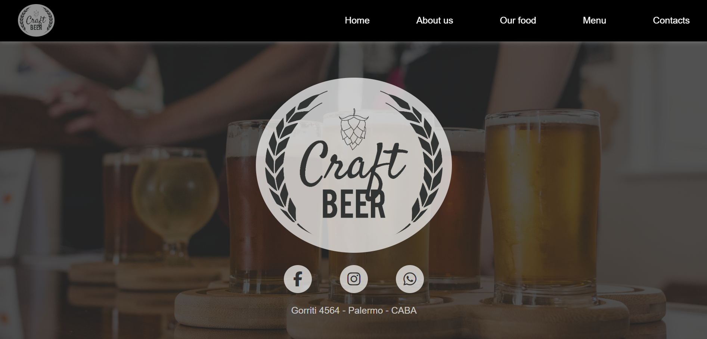

<h1 align="left">Bar & Restaurant´s Website</h1>

<h3 align="left">This frontend responsive project is dedicated to the creation of a dynamic and interactive website using the fundamental trio of web technologies: HTML, CSS, and JavaScript. The objective is to develop a user-friendly and visually appealing platform that seamlessly combines structure, style, and interactivity.</h3>

## 🌐 Socials:
 

## 💻 Tech Stack:
   

- 💻 This project is available at [https://resto-project-neon.vercel.app](https://resto-project-neon.vercel.app)

- 👨‍💻 All of my projects are available at [https://enrique-spinelli-port.vercel.app](https://enrique-spinelli-port.vercel.app)

- 📫 How to reach me **enriquespinelli.coder@gmail.com**
